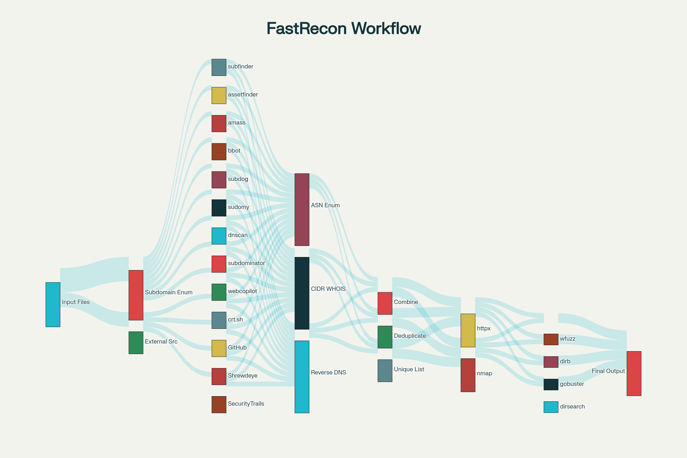

# FastRecon.sh

**Parallelized Subdomain & Endpoint Reconnaissance Pipeline**

*Coded by Youssef Hamdi*

## 🔍 Overview

FastRecon.sh is a comprehensive, automated reconnaissance framework designed for bug bounty hunters and penetration testers. It combines the power of multiple industry-leading tools in a parallelized pipeline to maximize subdomain discovery speed and coverage while maintaining accuracy and reliability.

The tool implements a multi-stage reconnaissance methodology that leverages both passive and active enumeration techniques, providing extensive attack surface discovery for security assessments.

## ✨ Key Features

- **🚀 Parallelized Execution**: Multiple tools run simultaneously to minimize total reconnaissance time
- **📊 Comprehensive Coverage**: Integrates 15+ subdomain enumeration tools and techniques
- **🔄 Multi-Source Aggregation**: Combines results from passive sources, APIs, and active scanning
- **🎯 Intelligent Deduplication**: Uses `anew` for efficient duplicate removal and result merging
- **💾 Organized Output**: Structured results directory with categorized findings
- **🌐 Live Host Detection**: Built-in probing and port scanning capabilities
- **📂 Endpoint Discovery**: Automated directory and file enumeration on live targets
- **🔧 Configurable**: Environment variable support for API keys and custom wordlists

## 🛠️ Tool Integration

### Core Subdomain Enumeration
- **subfinder** - Fast passive subdomain discovery
- **assetfinder** - Find domains and subdomains related to a given domain
- **amass** - In-depth DNS enumeration and network mapping
- **bbot** - Modular reconnaissance framework
- **subdog** - Multi-tool subdomain discovery wrapper
- **sudomy** - Fast subdomain enumeration with various techniques
- **dnscan** - Fast DNS scanner with wordlist support
- **subdominator** - Advanced subdomain enumeration
- **webcopilot** - Comprehensive web reconnaissance

### External Intelligence Sources
- **crt.sh** - SSL certificate transparency logs
- **GitHub** - Repository and code analysis (requires API key)
- **Shrewdeye** - Attack surface monitoring API
- **SecurityTrails** - DNS intelligence platform (requires API key)

### Network & Infrastructure
- **amass intel** - ASN and organization intelligence
- **whois** - Domain registration and network information
- **prips** - CIDR range IP enumeration for reverse DNS

### Live Host & Endpoint Discovery
- **httpx** - Fast HTTP toolkit for probing live hosts
- **nmap** - Network exploration and port scanning
- **wfuzz** - Web application fuzzer
- **dirb** - Web content scanner
- **gobuster** - Directory/file brute-forcer
- **dirsearch** - Advanced directory search tool
- **ffuf** - Fast web fuzzer for targeted port enumeration


## 📋 Prerequisites

### Required Tools
```bash
# Subdomain enumeration
subfinder assetfinder amass bbot subdog sudomy dnscan subdominator webcopilot

# HTTP probing and analysis  
httpx curl

# Network scanning
nmap

# Directory enumeration
wfuzz dirb gobuster dirsearch ffuf

# Utility tools
anew jq prips
```

### Installation Commands
```bash
# Install Go-based tools
go install -v github.com/projectdiscovery/subfinder/v2/cmd/subfinder@latest
go install github.com/tomnomnom/assetfinder@latest
go install -v github.com/projectdiscovery/httpx/cmd/httpx@latest
go install -v github.com/tomnomnom/anew@latest
go install -v github.com/ffuf/ffuf@latest

# Install via package manager (Ubuntu/Debian)
sudo apt update && sudo apt install -y amass nmap wfuzz dirb gobuster curl jq prips

# Install additional tools
pip3 install dirsearch
# Follow respective GitHub repositories for: bbot, subdog, sudomy, dnscan, subdominator, webcopilot
```

### API Key Configuration (Optional)
```bash
# GitHub Personal Access Token
export GITHUB_TOKEN="your_github_token_here"

# SecurityTrails API Key  
export SECURITYTRAILS_KEY="your_securitytrails_key_here"

# Add to ~/.bashrc or ~/.zshrc for persistence
echo 'export GITHUB_TOKEN="your_token"' >> ~/.bashrc
echo 'export SECURITYTRAILS_KEY="your_key"' >> ~/.bashrc
```

## 🚀 Usage

### Basic Usage
```bash
./FastRecon.sh targets.txt /path/to/wordlist.txt
```

### Example with Custom Wordlist
```bash
./FastRecon.sh domains.txt /usr/share/seclists/Discovery/DNS/subdomains-top1million-5000.txt
```

### Input File Format
Create a `targets.txt` file with one domain per line:
```
example.com
target-domain.com
another-target.org
```

## 📊 Output Structure

```
recon_results_YYYY-MM-DD_HH-MM/
├── subfinder.txt              # Subfinder results
├── assetfinder.txt           # Assetfinder results
├── amass.txt                 # Amass enumeration
├── bbot.json                 # BBOT comprehensive scan
├── subdog.txt                # Subdog results
├── sudomy.txt                # Sudomy findings
├── dnscan.txt                # DNS scan results
├── subdominator.txt          # Subdominator output
├── webcopilot.txt            # Webcopilot results
├── crtsh.txt                 # Certificate transparency
├── github_subs.txt           # GitHub discoveries
├── shrewdeye.txt             # Shrewdeye API results
├── securitytrails.txt        # SecurityTrails data
├── asns.txt                  # ASN information
├── cidrs.txt                 # CIDR ranges
├── prips_rdns.txt            # Reverse DNS results
├── all_subs.txt              # Combined unique subdomains
├── httpx_alive.txt           # Live HTTP/HTTPS hosts
├── nmap.txt                  # Nmap scan results
├── nmap_grep.txt             # Nmap greppable format
├── endpoints/                # Directory enumeration results
│   ├── wfuzz_*.txt          # Wfuzz findings per host
│   ├── dirb_*.txt           # Dirb results per host  
│   ├── gobuster_*.txt       # Gobuster output per host
│   └── dirsearch_first.txt  # Dirsearch sample scan
└── port_fuzz/                # Port-specific fuzzing
    └── *_PORT.json          # FFUF results per host/port
```

## 🔄 Workflow Stages

[21]

### Stage 1: Parallel Subdomain Enumeration
Multiple tools run simultaneously to gather subdomains from various sources and techniques.

### Stage 2: External Intelligence Gathering  
Queries external APIs and services for additional subdomain intelligence.

### Stage 3: ASN & Infrastructure Discovery
Identifies autonomous system numbers and IP ranges associated with targets.

### Stage 4: Data Aggregation & Deduplication
Combines all results and removes duplicates using advanced filtering.

### Stage 5: Live Host Detection
Probes discovered subdomains to identify active HTTP/HTTPS services.

### Stage 6: Network Reconnaissance  
Performs comprehensive port scanning on live targets.

### Stage 7: Endpoint & Directory Discovery
Enumerates directories, files, and endpoints on web applications.

### Stage 8: Targeted Port Analysis
Conducts focused fuzzing on specific ports discovered during scanning.

## ⚡ Performance Optimization

- **Parallel Processing**: Core enumeration tools run simultaneously
- **Efficient Deduplication**: Uses `anew` for memory-efficient duplicate removal  
- **Targeted Scanning**: Port-specific fuzzing based on nmap discoveries
- **Resource Management**: Proper backgrounding and wait operations
- **Output Optimization**: Structured file organization for easy analysis

## 🔒 Security Considerations

- **Scope Validation**: Always ensure targets are within authorized scope
- **Rate Limiting**: Be mindful of API rate limits and target server capacity
- **Legal Compliance**: Only use on systems you own or have explicit permission to test
- **Responsible Disclosure**: Follow proper vulnerability disclosure procedures

## 🛡️ Bug Bounty Integration

FastRecon.sh is optimized for bug bounty reconnaissance workflows:

- **Comprehensive Coverage**: Maximizes subdomain discovery for complete attack surface mapping
- **Speed Optimization**: Parallel execution reduces reconnaissance time significantly  
- **Integration Ready**: Output formats compatible with additional analysis tools
- **Scalable**: Handles large target lists efficiently
- **Professional Output**: Organized results suitable for documentation and reporting

## 🤝 Contributing

Contributions are welcome! Please feel free to submit pull requests, report issues, or suggest new features.

## 📄 License

This project is released under the MIT License. See LICENSE file for details.

## ⚠️ Disclaimer

FastRecon.sh is intended for authorized security testing and educational purposes only. Users are responsible for complying with all applicable laws and regulations. The author assumes no liability for misuse or damage caused by this tool.

**Always ensure you have explicit permission before testing any target.**

---

*FastRecon.sh - Empowering security researchers with comprehensive, efficient reconnaissance capabilities.*
